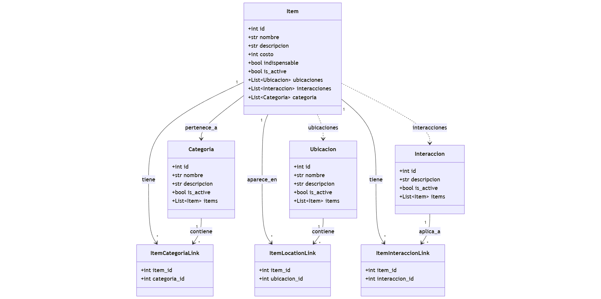

📘 Blasphemous Wiki API
=======================

🧩 Descripción general
---------------------
Este proyecto desarrollado con FastAPI y SQLModel, gestiona información del videojuego Blasphemous, incluyendo ítems, ubicaciones, interacciones y categorías, manteniendo relaciones muchos a muchos entre las entidades principales.

Permite registrar, consultar, actualizar y eliminar lógicamente los elementos del juego, además de gestionar relaciones entre ellos mediante tablas de enlace especializadas.

Cómo Clonarlo
--------------
1. Abre PyCharm (o tu editor preferido)
2. Selecciona la opción: Clonar repositorio
3. Ingresa el siguiente enlace de GitHub:  
   `https://github.com/[TU_USUARIO]/blasphemous-wiki-api.git` (reemplaza con tu enlace real)
4. Crea un terminal en el proyecto y ejecuta:  
   `pip install -r requirements.txt`
5. Con los requerimientos instalados, activa el servidor local con:  
   `uvicorn main:app --reload`

🗂️ Modelos y relaciones
----------------------

### 1. Item
Representa un ítem dentro del juego.

| Campo         | Tipo de dato | Descripción                                  |
|---------------|-------------|----------------------------------------------|
| id            | int         | Identificador único del ítem                 |
| nombre        | str         | Nombre del ítem                              |
| descripcion   | str         | Descripción detallada                        |
| costo         | int         | Costo en oración (si aplica)                 |
| categoria_id  | int         | ID de la categoría asociada                  |
| is_active     | bool        | Indica si el ítem está activo                |
| indispensable | bool        | Indica si el ítem necesario dentro del juego |
🔗 Relaciones:

- Pertenece a una categoría (N:1)
- Puede aparecer en múltiples ubicaciones (N:N, mediante ItemLocationLink)
- Puede tener múltiples interacciones (N:N, mediante ItemInteraccionLink)

### 2. Categoria
Categoría de un ítem (ejemplo: Arma, Consumible, Reliquia).

| Campo        | Tipo de dato | Descripción                  |
|-------------|-------------|------------------------------|
| id          | int         | Identificador único          |
| nombre      | str         | Nombre de la categoría       |
| descripcion | str         | Descripción de la categoría  |
| is_active   | bool        | Indica si la categoría está activa |

🔗 Relaciones:

- Contiene múltiples ítems (1:N)

### 3. Ubicacion
Lugar del juego donde puede encontrarse un ítem.

| Campo        | Tipo de dato | Descripción                  |
|-------------|-------------|------------------------------|
| id          | int         | Identificador único          |
| nombre      | str         | Nombre de la ubicación       |
| descripcion | str         | Descripción del área         |
| is_active   | bool        | Indica si la ubicación está activa |

🔗 Relaciones:

- Relación muchos a muchos con Item mediante ItemLocationLink

### 4. Interaccion
Interacción posible entre ítems o con el entorno.

| Campo        | Tipo de dato | Descripción                  |
|-------------|-------------|------------------------------|
| id          | int         | Identificador único          |
| descripcion | str         | Efecto o descripción         |
| is_active   | bool        | Indica si la interacción está activa |

🔗 Relaciones:

### 5. ItemCategoriaLink
Tabla intermedia para relación muchos a muchos entre Item y categoria.

| Campo        | Tipo de dato | Descripción        |
|--------------|-------------|--------------------|
| item_id      | int         | ID del ítem        |
| Categoria_id | int         | ID de la categoria |

### 6. ItemLocationLink
Tabla intermedia para relación muchos a muchos entre Item y Ubicacion.

| Campo        | Tipo de dato | Descripción                  |
|-------------|-------------|------------------------------|
| item_id     | int         | ID del ítem                  |
| ubicacion_id| int         | ID de la ubicación           |

### 7. ItemInteraccionLink
Tabla intermedia para relación muchos a muchos entre Item y Interaccion.

| Campo        | Tipo de dato | Descripción                  |
|-------------|-------------|------------------------------|
| item_id       | int         | ID del ítem                  |
| interaccion_id| int         | ID de la interacción         |

⚙️ Endpoints principales
-----------------------

### 📦 Items

| Método | Endpoint                   | Descripción                               | Parámetros / Cuerpo                                                               |
|--------|---------------------------|-------------------------------------------|-----------------------------------------------------------------------------------|
| GET    | /items/                    | Lista todos los ítems activos            | nombre , descripcion, costo, indispensablecategoria,ubicacion,interaccion, imagen |
| GET    | /items/estado/eliminados   | Lista ítems eliminados (inactivos)      | -                                                                                 |
| GET    | /items/search              | Busca ítems por nombre o descripción     | Nombre,Ubicacion_id, categoria_id, indispensables                                 |
| GET    | /items/{item_id}/detalles  | Obtiene ítem con relaciones (HTML)       | item_id                                                                           |
| POST   | /items/                    | Crea un nuevo ítem                        |  nombre, descripcion, costo, categoria_id                                 |
| PUT    | /items/{item_id}           | Actualiza un ítem                         |  nombre , descripcion, costo, indispensablecategoria,ubicacion,interaccion, imagen                                                                |
| DELETE | /items/{item_id}           | Elimina lógicamente un ítem               | item_id                                                                           |
| PUT    | /items/{item_id}/restaurar | Restaura un ítem eliminado               | item_id                                                                           |

### 🏷️ Categorías

| Método | Endpoint                            | Descripción                     | Parámetros / Cuerpo         |
|--------|------------------------------------|---------------------------------|-----------------------------|
| GET    | /categorias/                        | Lista todas las categorías activas | -                           |
| GET    | /categorias/eliminadas              | Lista categorías eliminadas (HTML) | -                           |
| GET    | /categorias/id/{categoria_id}       | Detalles de categoría (HTML)      | categoria_id                |
| POST   | /categorias/                        | Crea una nueva categoría          | nombre, descripcion, imagen |
| PUT    | /categorias/{categoria_id}          | Actualiza una categoría           | nombre, descripcion, imagen |
| DELETE | /categorias/{categoria_id}          | Elimina lógicamente una categoría | categoria_id                |
| PUT    | /categorias/{categoria_id}/restaurar | Restaura una categoría eliminada | categoria_id                |

### 🗺️ Ubicaciones

| Método | Endpoint                             | Descripción                        | Parámetros / Cuerpo               |
|--------|-------------------------------------|------------------------------------|-----------------------------------|
| GET    | /ubicaciones/                        | Lista todas las ubicaciones activas| -                                 |
| GET    | /ubicaciones/eliminadas              | Lista ubicaciones eliminadas       | -                                 |
| GET    | /ubicaciones/id/{ubicacion_id}      | Obtiene una ubicación específica   | ubicaciones_id                    |
| POST   | /ubicaciones/                        | Crea una nueva ubicación           | nombre, tipo, descripcion, imagen |
| PUT    | /ubicaciones/{ubicacion_id}          | Actualiza una ubicación            | nombre, tipo, descripcion, imagen |
| DELETE | /ubicaciones/{ubicacion_id}          | Elimina lógicamente una ubicación  | ubicaciones_id                    |
| PUT    | /ubicaciones/{ubicacion_id}/restaurar | Restaura una ubicación eliminada  | ubicaciones_id                    |

### 🔄 Interacciones

| Método | Endpoint                             | Descripción                       | Parámetros / Cuerpo                 |
|--------|-------------------------------------|-----------------------------------|-------------------------------------|
| GET    | /interacciones/                      | Lista todas las interacciones activas | -                                   |
| GET    | /interacciones/eliminadas            | Lista interacciones eliminadas    | -                                   |
| GET    | /interacciones/id/{interaccion_id}  | Obtiene una interacción específica | interaccion_id                      |
| POST   | /interacciones/                      | Crea una nueva interacción        | descripcion, imagen                 |
| PUT    | /interacciones/{interaccion_id}      | Actualiza una interacción         | interaccion_id, descripcion, imagen |
| DELETE | /interacciones/{interaccion_id}      | Elimina lógicamente una interacción | interaccion_id                      |
| PUT    | /interacciones/{interaccion_id}/restaurar | Restaura una interacción eliminada | interaccion_id                      |

### 📊 Dashboard

| Método | Endpoint              | Descripción                 |
|--------|----------------------|-----------------------------|
| GET    | /imagenes/dashboard   | Panel de control visual (HTML) |

⚠️ Manejo de errores HTTP
------------------------

| Código | Tipo          | Descripción                                   | Causa común                         |
|--------|---------------|-----------------------------------------------|-------------------------------------|
| 200 OK | Éxito         | Solicitud procesada correctamente            | Operaciones GET o PUT exitosas      |
| 201 Created | Creación   | Recurso creado correctamente                  | Registro nuevo insertado            |
| 400 Bad Request | Error del cliente | Solicitud mal formada o datos inválidos  | Datos faltantes o tipos incorrectos|
| 404 Not Found | No encontrado | Recurso solicitado no existe o está inactivo | ID inexistente                   |
| 409 Conflict | Conflicto   | Recurso duplicado o viola restricción        | Nombre ya registrado                |

-------------------------
🧱 Estructura del proyecto
-------------------------
blasphemous_wiki/  
├── .gitignore  
├── blasphemous.db  
├── crud.py  
├── db.py  
├── main.py  
├── models.py  
├── requirements.txt  
├── schemas.py  
├── supa/  
│   └── supabase.py  
├── static/  
│   ├── css/  
│   │   └── styles.css  
│   ├── img/  
│   └── js/  
└── templates/  
    ├── base.html  
    ├── dashboard.html  
    ├── footer.html  
    ├── header.html  
    ├── index.html  
    ├── categorias/  
    │   ├── categoria_detalles.html  
    │   ├── categorias.html  
    │   └── eliminados.html  
    ├── interacciones/  
    │   ├── interacciones.html  
    │   ├── interacciones_detalles.html  
    │   └── interacciones_eliminados.html  
    ├── items/  
    │   ├── items.html  
    │   ├── items_detalles.html  
    │   ├── items_eliminados.html  
    │   └── items_search.html  
    └── ubicaciones/  
        ├── ubicaciones.html  
        ├── ubicaciones_detalles.html  
        └── ubicaciones_eliminados.html
